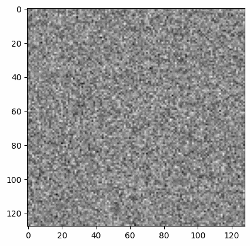

# Diffusion Music Maker

This repository contains a PyTorch implementation of a **Diffusion Model** for generating musical scores represented as images and converting them into audio files. The project demonstrates how machine learning models can create novel music by learning patterns from a dataset of musical scores.

---

## Overview

This project trains a diffusion model to generate 128x128 images representing music scores. The process involves:
1. **Diffusion Training**: Learning to denoise progressively noisier versions of the data.
2. **Score Sampling**: Using the trained model to generate new images.
3. **MIDI and Audio Conversion**: Translating generated scores into MIDI files and audio (WAV format).

---

## Dataset

This project uses **The Lakh MIDI Dataset** as the source of musical data. The dataset provides a collection of MIDI files, which were preprocessed into 128x128 grayscale images for training. 

### MIDI to Image Conversion
Each MIDI file was converted into an image where:
- The **y-axis** represents pitch (0–127).
- The **x-axis** represents time steps.

This encoding preserves the temporal structure and pitch relationships, enabling the model to generate realistic musical patterns.

---

## Results

Here are some examples of generated musical scores and corresponding audio:

### Example 1
#### Generated Image

#### Audio
<audio controls>
  <source src="song_1.wav" type="audio/wav">
  Your browser does not support the audio element.
</audio>

### Example 2
#### Generated Image

#### Audio
<audio controls>
  <source src="song_2.wav" type="audio/wav">
  Your browser does not support the audio element.
</audio>

### Example 3
#### Generated Image

#### Audio
<audio controls>
  <source src="song_3.wav" type="audio/wav">
  Your browser does not support the audio element.
</audio>

---

## Acknowledgments

This project is inspired by the work on **Denoising Diffusion Probabilistic Models** (Ho et al.) and combines it with MIDI and audio generation using **PrettyMIDI**. Special thanks to **The Lakh MIDI Dataset** for providing high-quality MIDI files for training.

---

Feel free to explore, experiment, and generate your music! 🎵
